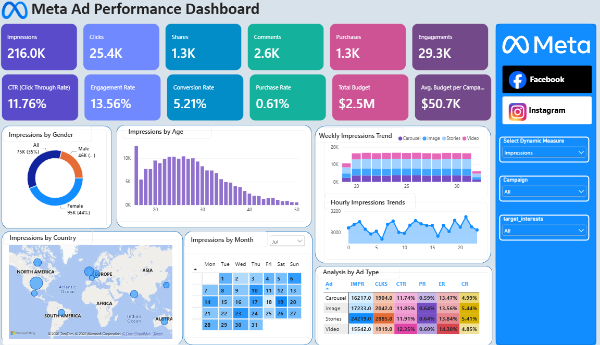
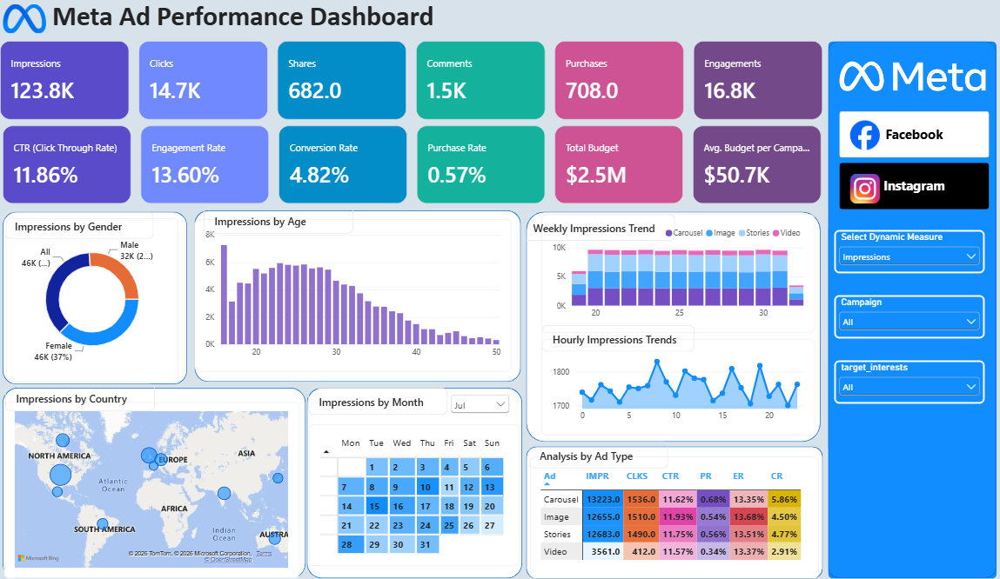

# Ad Performance Analysis

A Power BI dashboard for analyzing paid advertising performance across **Facebook and Instagram**.

The project focuses on understanding how campaigns perform across the advertising funnel - from **impressions and clicks to engagement and purchases** - while also exploring audience, geographic, time-based, and ad-format patterns.

## What the Dashboard Covers

- Facebook vs. Instagram campaign performance
- Reach, clicks, engagement, and conversions
- Audience breakdown by age and gender
- Geographic distribution of ad activity
- Weekly and hourly performance trends
- Performance comparison across ad formats such as Carousel, Image, Stories, and Video
- Campaign budget overview

## Dashboard Preview

### Facebook

### Instagram

## Dataset

The project uses the **Social Media Advertisement Performance** dataset from Kaggle.

**Dataset:** [Social Media Advertisement Performance – Kaggle](https://www.kaggle.com/datasets/alperenmyung/social-media-advertisement-performance/data)

The dataset contains simulated paid-ad event data covering users, campaigns, advertisements, and interactions such as impressions, clicks, shares, comments, and purchases.

## Tools Used

- **Power BI** - Dashboard design, data modeling, and visualization
- **DAX** - KPI calculations and measures
- **Kaggle** - Source dataset

## Dashboard

The report contains dedicated views for **Facebook** and **Instagram**, with interactive filters and visuals that allow campaign performance to be explored from different perspectives.

## Project Goal

The goal is to turn raw advertising event data into a clear, interactive report that helps a marketing team understand **where campaigns are performing, how audiences respond, and how different ad formats contribute to results**.
